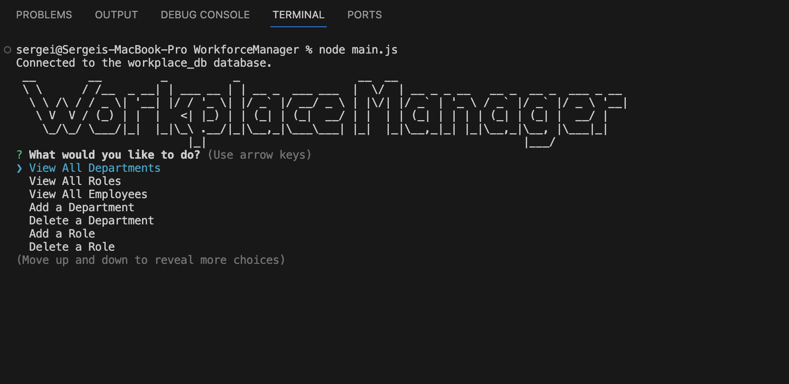
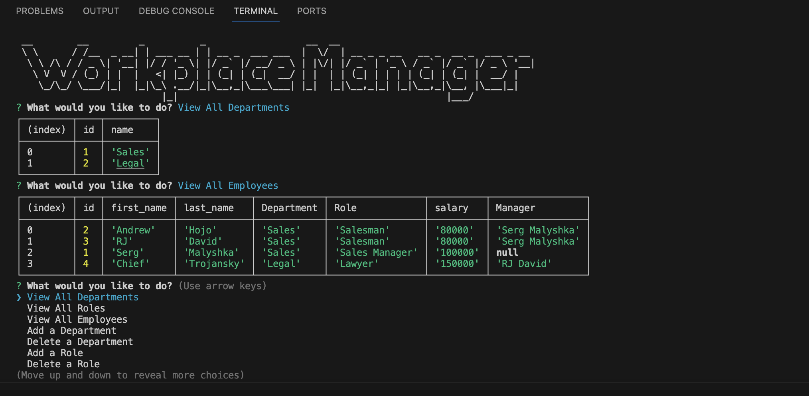

# WorkforceManager

## Description

The application is a CLI for a workforce manager, which allows full control of employees, departments, roles and their relationship to each other. 

Project was done to practice writing MySQL queries, as well as practice using classes with an async approach to the differnet promise based functions

## Table of Contents 

- [Installation](#installation)
- [Usage](#usage)
- [Credits](#credits)
- [License](#license)

## Installation

Run `npm i` to install all the needed dependencies, run `node main.js` to launch the applicationg

## Usage

After running the `node main.js` command, simply use the up and down arrow keys to select what you desire to do next from the provided list

## Credits

All of the work was done by Serg Malyshka

## License

---
